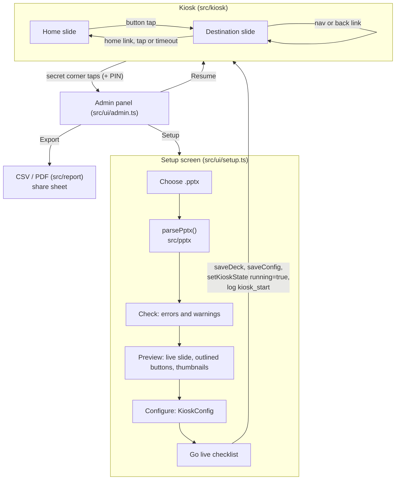
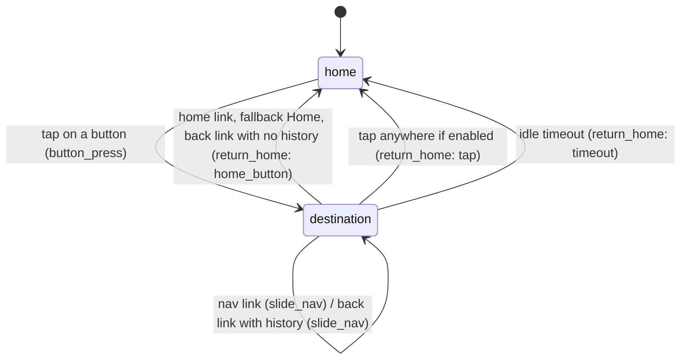

# stuPad architecture

How the app works end to end, and a tour of the codebase. For *what* the app must do see [SPEC.md](SPEC.md); for the module contracts and the original build plan see [PLAN.md](PLAN.md).

## 1. What stuPad does

stuPad is a static, offline-first PWA for iPad Safari. An admin loads a specially structured `.pptx` from the Files app; stuPad parses it in the browser, shows it as a full-screen touch kiosk, logs every tap to IndexedDB, and turns the log into a CSV and a PDF report that the admin shares off the device.

There are two people and one device:

- **Admin** (event staff): loads the deck, configures, starts and stops the kiosk, exports reports.
- **End user** (public): only ever sees the kiosk: a home slide with buttons, and the destination slides those buttons open.

There is no server, no account, no network use after the first load. Everything runs in one page.

## 2. The life of a session



1. **Load.** The admin picks a `.pptx`. `parsePptx` unzips it (JSZip), reads the slide XML, resolves themes, layouts, masters, colours, fonts and backgrounds, and produces a plain-data `Deck` (see `src/types.ts`) plus a list of `Issue`s. It never throws; an unreadable file yields an `unreadable_file` issue.
2. **Check.** Errors (fewer than two buttons, broken links, too large, no slides) block Go live. Warnings (missing fonts, unsupported elements, unlinked slides, no way home) can be accepted.
3. **Preview.** The real `SlideStage` renderer shows the home slide with each detected button outlined and labelled; tapping an outline navigates the same way the kiosk will. Thumbnails show every slide. An "image mode" checkbox rasterises each slide to a PNG as a fallback for decks that render badly.
4. **Configure.** Button labels, timeout, return methods, feedback, transition, debounce, secret pattern, PIN, session name. `validateConfig` blocks Go live on invalid values. The deck and config are debounce-saved to IndexedDB as you edit.
5. **Go live.** A checklist modal (Guided Access, Auto-Lock, charge, brightness) plus a wake-lock probe. Confirming creates a `sessionId` (UUID), writes `KioskState { running: true }`, logs `kiosk_start`, and mounts the kiosk.
6. **Run.** The kiosk runs unattended. Every tap goes through `KioskController.handleTap` (section 4).
7. **Exit.** Tapping the four screen corners in the configured order within the time window opens the admin panel (after a PIN pad if a PIN is set). From there: Resume (same session, no new `kiosk_start`), Export, Clear log, Clear previous data (see below), or Setup (logs `kiosk_stop`, clears the running flag).
8. **Relaunch.** On launch `main.ts` reads `KioskState`. If a session was running and a deck and config exist, it goes straight back into kiosk mode on the home slide and logs `app_resume`. So a crash, kill or power cycle recovers by itself.

## 3. Deck model and PPTX parsing (`src/pptx/`)

Buttons are plain PowerPoint shapes with a click action, so the deck also works when played in PowerPoint. The parser turns them into four kinds of link, all detected from a shape's `hlinkClick` (`resolveLink` in `shapes.ts`):

| Kind | Where | PowerPoint action | Type |
| --- | --- | --- | --- |
| Button | Slide 1 | Link to Slide N (N > 1) | `ButtonDef` (`deck.buttons`) |
| Home link | Slides 2+ | Link to slide 1 (or First Slide) | `HomeLinkDef` (`deck.homeLinks`) |
| Nav link | Slides 2+ | Link to another slide, or Next/Previous/Last Slide | `NavLinkDef` (`deck.navLinks`) |
| Back link | Slides 2+ | "Last Slide Viewed" (`jump=lastslideviewed`) | `BackLinkDef` (`deck.backLinks`) |

A link on a group counts for the group (`findLink` searches descendants). A link to a shape's own slide is a `self_link` warning and is ignored.

Pipeline (`src/pptx/index.ts`):

```
Blob ─ Pkg.load (zip.ts) ─ loadDeck (deck.ts) ─ detectButtons/HomeLinks/NavLinks/BackLinks (buttons.ts) ─ validateDeckAndSize (validate.ts) ─▶ { deck, issues }
```

| File | Role |
| --- | --- |
| `zip.ts` | `Pkg` wraps JSZip: read parts, parse XML, follow `.rels` relationships (`resolvePath`, `relsPathFor`). |
| `xml.ts` | Thin DOMParser helpers that match on local name, ignoring namespace prefixes. Same code runs in the browser and in jsdom tests. |
| `deck.ts` | `presentation.xml` → slide order and size; for each slide loads its layout, master and theme, parses shapes, and prepends visible non-placeholder layout and master shapes. Resolves the background (slide → layout → master). |
| `shapes.ts` | `<p:sp>`, `<p:pic>`, `<p:grpSp>`, `<p:graphicFrame>` → `SlideElement`. Group children are flattened into slide px. Charts/SmartArt/unknown geometry become `unsupported_element` warnings. Also holds `resolveLink`. |
| `text.ts` | Text bodies: runs, paragraphs, bullets, spacing; walks the run-property fallback chain (master → layout → shape). |
| `color.ts` | Theme colours, `clrMap`, and colour transforms (tint, shade, lumMod, alpha…) → CSS colours. |
| `background.ts` | Solid, gradient and picture fills for backgrounds. |
| `geometry.ts` | **The only place EMU is converted** to slide px (`makeScale`, `ptToPx`, `parseXfrm`). |
| `fonts.ts` | `KNOWN_FONTS` (iPad system fonts, generic families, and a few named web fonts) and `isKnownFont`. |
| `buttons.ts` | The four detectors, reading-order sort, default labels (`prettyName`: `BTN_Our_People` → "Our People"; PowerPoint default names like "Rectangle 3" are skipped in favour of the shape text, then "Button N"). |
| `validate.ts` | `validateDeck` (deck-only checks, re-run on a deck loaded from storage) and `validateDeckAndSize` (adds `too_large`). Reachability is a BFS from slide 1 through button targets and nav-link chains. |

**Geometry rule.** Everything downstream works in *slide px*: the slide is always `SLIDE_W` (1920) wide and `deck.height` tall (1080 for 16:9). Screen coordinates are converted with `SlideStage.toSlide()` and nowhere else.

## 4. Rendering (`src/render/index.ts`)

- **`SlideStage`** builds one absolutely-positioned DOM tree per slide up front (never rebuilt on a tap), inside a fixed 1920 px-wide `scaler` that is CSS-transformed to fit the container and letterboxed. `show(index, transition)` swaps layers, cross-fading if asked, and resolves when done. `toSlide(clientX, clientY)` inverts the transform and returns `{ px, py, xPct, yPct }`, or `null` in the letterbox. `overlay` is a slide-px layer for outlines, press feedback, the fallback Home button and the idle countdown. `destroy()` revokes every object URL and disconnects the `ResizeObserver`.
- **Elements** map to DOM: shapes (rect / rounded rect / ellipse / line) via CSS, pictures with crop, groups, basic tables, text with bullets and auto-numbering.
- **Bundled fonts** (`fonts.ts`, generated `font-faces.ts`, files in `public/fonts/`): Inter, Lato, Montserrat, Open Sans and Roboto (Latin and Latin-Extended subsets, WOFF2, SIL OFL licences alongside). `ensureStyles` injects one `@font-face` rule per file under `BASE_URL`, and the service worker precaches the files. `KioskController.start` calls `preloadDeckFonts` so the first slide doesn't paint in a fallback face. The raster fallback draws through an SVG image, which cannot load page fonts, so `embeddedFontCss` inlines only the families and styles a slide uses as data URLs. `npm run fonts` (`scripts/make-fonts.mjs`) re-downloads the files and regenerates the manifest; edit the Google Fonts URL in that script to add a family.
- **`renderThumbnail`** builds a small static rendering for the setup grid (`releaseThumbnails()` revokes its URLs).
- **Raster fallback.** `rasterizeDeck` snapshots each slide's DOM through an SVG `<foreignObject>` onto a canvas and stores `raster/N.png` in `deck.media` with `slide.rasterKey`. With `config.useRaster`, the stage shows those images. Per-slide failures (Safari can taint the canvas) are caught and that slide just renders live. `rasterizeSlide` does one slide and is also used to make the PDF's home-slide thumbnail.

## 5. Kiosk runtime (`src/kiosk/index.ts`)

`KioskController` is a two-mode state machine, `home` and `destination`, driven by `pointerdown` on the stage host.



**Order of checks on every tap** (`handleTap`):

1. Convert to slide coordinates. Taps in the letterbox are dropped (not logged).
2. **Secret sequence** (`SecretSequenceDetector.step`). A tap that *continues or completes* an attempt is consumed: completion calls `onAdminRequested`. The first corner tap of a sequence is *not* consumed, so a button sitting in a corner still works (the trade-off is that starting the sequence on a slide with such a button presses it once).
3. **Debounce.** A tap within `debounceMs` of the last accepted tap is ignored entirely: no log, no state change.
4. **Home mode.** Hit-test `deck.buttons`. A hit shows press feedback, starts a visit (new `visit_id`, remembers the button), logs `button_press`, shows the target, and starts the timeout. A miss logs `miss_tap` with x/y percentages.
5. **Destination mode**, in priority order: home link → fallback Home button → back link → nav link → tap-anywhere (if enabled) → otherwise just reset the timeout.

**Visits.** A visit runs from a button press to the return home. `visitPath` is the per-visit history of destination slides (capped at 100) that back links pop; it is cleared on every return, including a timeout. `return_home.dwell_ms` is the whole visit's time; `slide_nav.dwell_ms` is the time on the slide being left.

**Fallback Home button.** If the current destination has no home link or back link and `returnMethods.homeButton` is on, an 88 px "Home" overlay is drawn bottom-centre (never in a corner region), so no slide is a dead end. It is removed and re-evaluated on every slide change.

**Timeout and idle warning.** Each new destination slide, and any tap on it, restarts the timer; with `idleWarning` a 5-second countdown appears in the last 5 s.

**Lockdown.** `touch-action: none`; `touchstart`, `gesturestart`, `dblclick`, `contextmenu` and `selectstart` are `preventDefault`ed. The Screen Wake Lock is acquired on start and re-acquired on `visibilitychange`.

**Cleanup.** `stop()` removes every listener, clears all timers, releases the wake lock and destroys the stage, which is what makes 12-hour runs safe.

Other exports: `pointInRect`, `cornerOf` (12% corner zones), `checklist()` (operator checklist text) and `acquireWakeLock()` (a one-shot probe used by Setup). Secret patterns: `corners_cw`, `corners_ccw`, `tl3_br2`.

## 6. Storage (`src/store/index.ts`)

One IndexedDB database, `stupad` (version 1), via `idb`:

| Object store | Contents |
| --- | --- |
| `deck` | The parsed `Deck`, including media `Blob`s, under key `current` |
| `config` | `KioskConfig`, key `current` |
| `state` | `KioskState { running, sessionId, startedAt }`, key `current` |
| `events` | `LogEvent` rows, auto-increment `id`, indexes on `session_id` and `t` |

Details that matter:

- **Durability.** `appendEvent` resolves only after the transaction's `done`, so a resolved write survives a kill. Writes go through an in-memory queue (`enqueue`) so ids follow call order. The kiosk never awaits `appendEvent` on the tap path (`App.log` in `main.ts` fire-and-forgets and reports errors to the console).
- **`t` mirror.** Each stored event carries an epoch-ms `t` used for range queries; it is stripped before rows are returned. Range comparisons are by instant, not string.
- **Append-only.** Events are only ever deleted in bulk, and each bulk delete appends a `log_cleared` record so the clear itself is logged. `clearEvents(sessionId)` clears the events store. `clearAllData(sessionId)` ("Clear previous data") clears the deck, config, state and events stores in one transaction so the next person starts from nothing.
- **Migration shim.** `loadDeck` defaults `navLinks`/`backLinks` to `[]` for decks saved before those fields existed.
- **Persistence.** `requestPersistence()` asks Safari not to evict the data.
- No `localStorage` anywhere.

## 7. Reporting (`src/report/`)

- `computeStats(events, labels)` is a pure, single-pass aggregate: presses and share per button, visits, average dwell, returns by method, timeout share, activity buckets (width auto-picked from 5 min to 1 day, at most 48 buckets), an hour-by-day heatmap for multi-day data, and slide arrivals (`slideViews`) from `button_press` and `slide_nav`.
- `toCsv` writes RFC 4180 CSV with CRLF endings and a UTF-8 BOM (so Excel reads non-ASCII labels), columns from `CSV_COLUMNS`. `csvFileName`/`pdfFileName` produce `<session>_<yyyy-mm-dd-hhmm>.ext`.
- `buildPdf` lazy-imports jsPDF (so it isn't parsed at kiosk start) and builds an A4-landscape report: Summary (with the home-slide thumbnail and, when nav links were used, a Slide views table), Button share, Activity over time, Return behaviour, and Hour by day when the data spans days.
- `charts.ts` draws donut, bar, stacked-activity and heatmap charts on `<canvas>` by hand; the canvases are embedded as PNGs. `colors.ts` (`buttonColor`, `returnMethodColor`) keeps a button's colour identical on every chart.
- `exportFile` prefers `navigator.share({ files })` (iOS share sheet), and falls back to an `<a download>` click. A cancelled share returns `'cancelled'`.

## 8. UI shell (`src/main.ts`, `src/ui/`)

No framework; `ui/dom.ts` provides `h(tag, props, children)`, `clear`, `debounce`, `fmtBytes`.

- **`main.ts` `App`** is the router and owner of the session. It holds `deck`, `config`, `sessionId`, the `KioskController`, and creates the fixed `.kiosk-root` element. `log()` stamps `ts` (`isoLocal`) and `session_id` and appends to the store. Admin, PIN pad and setup are overlays/screens it mounts and destroys. It also logs `app_resume` when the page becomes visible in kiosk mode.
- **`ui/setup.ts` `SetupScreen`**: the five-step admin screen described in section 2.
- **`ui/admin.ts` `AdminPanel`**: session stat tiles, export scope (session / date range / all) with a live event count, CSV and PDF export, Clear log behind typing `CLEAR`, and Clear previous data.
- **`ui/clear-data.ts`**: the "Clear previous data" confirmation dialog shared by Setup (Load step) and the admin panel. On confirm, `App.clearAll()` in `main.ts` stops the kiosk and tears down the mounted screen (cancelling Setup's pending autosave so the old deck isn't saved again), calls `clearAllData`, then reloads the page so no in-memory deck, fonts or object URLs survive.
- **`ui/pinpad.ts` + `pinpad-logic.ts`**: numeric PIN overlay; three wrong attempts or 30 s idle returns to the kiosk. Wrong attempts log `admin_unlock_fail`.
- **Pure helpers, unit-tested without a DOM:** `lifecycle.ts` (`decideStartupScreen`), `config-validate.ts`, `export-scope.ts`.
- `styles.css` holds all styling, including the `html.kiosk-active` lock-down rules (no overscroll, fixed root).

## 9. Offline, PWA and deployment

- `vite-plugin-pwa` (`registerType: 'autoUpdate'`) generates a Workbox service worker that precaches JS, CSS, HTML, SVG, PNG, WOFF2 and `template.pptx`. `main.ts` registers it with `registerSW({ immediate: true })`.
- The manifest is fullscreen, landscape. `index.html` adds the Apple meta tags for Home Screen standalone mode.
- **Base path.** `vite.config.ts` reads `BASE_PATH` (the Pages workflow sets `/stuPad/`). Code must use `import.meta.env.BASE_URL` and `index.html` `%BASE_URL%`; never hard-code `/`.
- `.github/workflows/deploy-pages.yml`: on push to `main`, `npm ci`, `npm test`, `npm run build`, deploy `dist/` to GitHub Pages.
- Icons, the template deck and the fonts are generated by `scripts/make-icons.mjs`, `scripts/make-template.mjs` (which also writes the test fixtures) and `scripts/make-fonts.mjs`.

## 10. Tests

`npm test` runs Vitest in jsdom with `fake-indexeddb`. `tests/` mirrors `src/`:

| Dir | Covers |
| --- | --- |
| `tests/pptx` | Parsing fixtures, colour resolution, unit conversion, validation |
| `tests/render` | Shapes, text, `SlideStage` (fit, `toSlide`, fades, URL revocation), bundled fonts (manifest matches files and licences, raster embedding) |
| `tests/kiosk` | Secret-sequence detector; controller flows (press, nav, back, timeout, debounce, cleanup) |
| `tests/store` | Durability, ordering, filters, clear, 100k-event scale, reopen |
| `tests/report` | Stats, CSV, PDF, charts (mock canvas context), export |
| `tests/ui` | Setup screen, config validation, PIN logic, export scope, lifecycle |

Fixtures in `tests/fixtures/` are generated by `npm run template`; don't hand-edit them. Real iPad behaviour (share sheet, wake lock, Guided Access, standalone mode, storage persistence) can't be tested in jsdom; check it on a device after changing kiosk, export or service-worker code.

## 11. Extending it

- **New setting:** add the field to `KioskConfig` and `defaultConfig` (`src/types.ts`, additive), add a control in `renderConfigureStep`, a rule in `validateConfig`, and use it in the kiosk. Old stored configs won't have the field, so read it defensively.
- **New event type:** add to `EventType`, emit it via the `log` callback, and update `computeStats`, the CSV docs in SPEC, and any chart that should show it. `CSV_COLUMNS` only needs changing for new fields.
- **New link kind:** detect it in `resolveLink`/`buttons.ts`, add a `*Def` type and a `Deck` field (with a store-load default), handle it in `handleDestinationTap`, `validate.ts` reachability, and the Setup preview overlay.
- **Shared contract changes** go through `src/types.ts` and must be additive; update every consumer in the same change.

## 12. Known gaps

- Only the Latin and Latin-Extended subsets of the bundled fonts are included, so Cyrillic, Greek and Vietnamese text falls back to a system font. Lato is available only in weights 100, 300, 400, 700 and 900; other weights snap to the nearest.
- Embedding fonts in the raster fallback has been unit-tested but not checked on real iPad Safari, which can be fussy about fonts in SVG images. If image mode shows the wrong font on a device, that is the place to look.
- Vertical text, and auto-number schemes beyond a handful of common ones, render approximately. See the "Limitations" comment at the end of `src/render/index.ts`.
- Animations, transitions, video and audio in the deck are ignored; the app uses its own fade.
