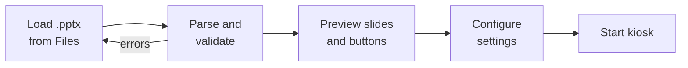
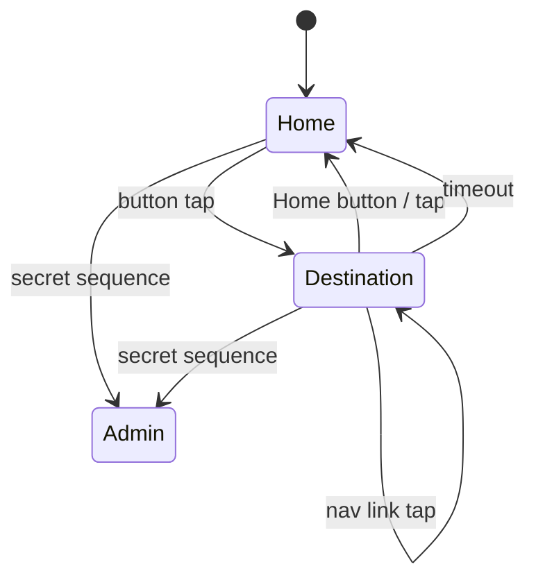

# iPad PowerPoint Kiosk App: Specification

Sep 24, 2026 · @Graham Lehr

## Overview and goals

An installable web app (PWA) turns a structured PowerPoint file into a self-running, touch-driven iPad kiosk that logs every interaction and produces CSV and PDF reports offline.

Goals for v1:

- Load a .pptx from the iPad's Files app and render it in the browser, with no conversion step.
- Detect the buttons on the home slide automatically and map each to a destination slide.
- Run unattended: home slide, button press, destination slide, back to home (by tap or timeout).
- Log every interaction with a timestamp to on-device storage, surviving app restarts.
- Let the admin exit via a secret tap sequence and export a CSV log and a PDF summary.

Out of scope for v1: video and animation playback, syncing logs across multiple iPads, and any server-side component after setup. Destination slides may link onward to further slides (see "PowerPoint template rules" and "Kiosk mode behaviour" below); a slide reachable only through such a chain still needs a way back to Home, which the kiosk provides as a fallback if the deck doesn't.

## Users and roles

Two roles, one device: the admin configures and exports; the end-user only ever sees kiosk mode.

| Role | Who | Can do | Cannot do |
| --- | --- | --- | --- |
| Admin-user | Event or stand staff | Load deck, configure settings, start/stop kiosk, export and clear logs | Leave the app while Guided Access is on |
| End-user | Public or delegates at the stand | Tap buttons, return to home slide | Reach settings, see other slides, leave the app |

There is no login. Admin access is protected by the secret tap sequence plus an optional 4 to 6 digit PIN.

## Platform and technical constraints

The app is a static PWA on iPadOS Safari, online once for install and setup, fully offline thereafter.

| Area | Decision | Why |
| --- | --- | --- |
| Target | iPadOS 17+, Safari, added to Home Screen, landscape only | Home Screen web apps get standalone display and persistent storage |
| Hosting | Static files (e.g. Render static site); no backend | Nothing to run after setup |
| Offline | Service worker precaches the app shell, fonts and all libraries on first load | iPad has no internet during the event |
| File input | `<input type="file" accept=".pptx">` opening the Files app picker | A web app cannot read arbitrary file paths; the admin picks the file |
| PPTX parsing | JSZip + XML parsing of `ppt/slides/*.xml` and relationships | .pptx is a zip of XML; structure is fully readable |
| Slide rendering | Custom renderer to DOM/SVG at a fixed 16:9 canvas, scaled to screen | Direct rendering was chosen; see fidelity note below |
| Storage | IndexedDB for the deck, config and log; `navigator.storage.persist()` requested | localStorage is too small and synchronous for logs |
| PDF export | Generated on-device (e.g. jsPDF with charts drawn to canvas) | No server available |
| Lockdown | iOS Guided Access (or MDM Single App Mode) | A web app cannot stop the Home gesture on its own |

**Rendering fidelity.** Browser rendering of PowerPoint will never be pixel-identical. Fidelity is made reliable by constraining the deck (next section) rather than by building a full PowerPoint engine. After rendering, the setup screen shows every slide as a thumbnail so the admin can confirm it looks right before going live.

**Fallback option.** If a deck fails validation or renders badly, the renderer can rasterise each slide once during setup and store images, so kiosk mode only ever displays static images. Worth building in from the start as a safety net.

## PowerPoint template rules

Buttons are ordinary shapes on slide 1 with PowerPoint's own "Link to: Slide N" action, so the deck also works when played in PowerPoint.

**Structure**

1. Slide 1 is the home slide and must contain at least 2 button shapes.
2. Each button links to a later slide (Insert > Link > Place in This Document > Slide N). Stored in the XML as a `ppaction://hlinksldjump` click action.
3. Each destination slide may contain a shape linked back to slide 1, rendered as a "Home" button.
4. A destination slide may also contain shapes linking onward to a further slide — a "Next", "Back", or similarly named shape — so a deck isn't limited to a flat Home <-> Destination pair. These may be an explicit "Link to: Slide N", or PowerPoint's "Next Slide" / "Previous Slide" / "First Slide" / "Last Slide" actions (resolved relative to the shape's own slide, and clamped to the deck — a "Next Slide" link on the last slide simply has no target). A slide reached only through such a chain is still "linked" for validation purposes, but is still flagged with a warning if it has no way back to slide 1.
5. A shape that links to its own slide is an authoring mistake, not a nav link: it is flagged as a warning and otherwise ignored, rather than crashing or creating a self-loop.
6. Slides not reachable from slide 1 (by a home-slide button, optionally followed by a chain of nav links) are ignored (flagged as a warning, not an error).
7. Two buttons may point to the same slide; they are still logged separately.

**Button naming.** The report uses the shape's name from the Selection Pane (e.g. `BTN_Sustainability`). If unnamed, the app uses the shape's text; if neither exists, "Button 1", "Button 2" in reading order. The admin can rename labels in setup.

**Supported content**

| Element | Supported | Notes |
| --- | --- | --- |
| Solid, gradient and picture backgrounds | Yes | Including slide master and layout backgrounds |
| Images (PNG, JPEG, SVG) | Yes | Crops honoured |
| Text boxes and placeholders | Yes | Font, size, colour, bold/italic, alignment, bullets, autofit off |
| Basic shapes (rectangle, rounded rectangle, ellipse) | Yes | Fill, outline, corner radius |
| Groups | Yes | A group can be a button |
| Tables | Basic | Cell text and fills only |
| Charts, SmartArt | No | Paste as images first |
| Animations, transitions | No | Ignored; app uses its own fade |
| Video, audio | No | Candidate for v2 |

**Fonts.** Use fonts embedded in the file, a small set of approved web fonts bundled with the app, or iPad system fonts. Anything else falls back and is flagged at setup.

**Slide size.** 16:9 (13.333 x 7.5 in). Other sizes are letterboxed.

The app should ship with a downloadable template .pptx that follows all these rules.

## Admin setup flow

Setup is one screen with four steps: load, check, configure, go live.



Validation errors (fewer than 2 buttons, broken links, unreadable file) block go-live. Warnings (missing fonts, unsupported elements, unlinked slides) are shown but can be accepted.

The preview shows the home slide with each detected button outlined and labelled, plus a thumbnail of each destination slide. Tapping a button in preview navigates as it will in kiosk mode.

**Configurable settings**

| Setting | Default | Range / options |
| --- | --- | --- |
| Button labels (for reports) | From shape name or text | Free text |
| Return-to-home timeout | 20 s | 5 to 300 s, or off |
| Return method | Home button or timeout | Home button only / tap anywhere / timeout only / combination |
| Idle warning before timeout | Off | Show countdown in last 5 s |
| Button press feedback | Brief highlight | None / highlight / scale |
| Transition | Fade 300 ms | None / fade |
| Debounce | 800 ms | Ignore repeat taps within this window |
| Secret exit sequence | Four corners clockwise from top-left, within 5 s | Choice of 2 or 3 patterns |
| Admin PIN after sequence | Off | 4 to 6 digits |
| Session name | Deck file name + date | Free text, printed on reports |

Settings and the parsed deck are saved to IndexedDB, so reopening the app resumes where it left off, including straight back into kiosk mode if it was running.

## Kiosk mode behaviour

Kiosk mode is a Home <-> Destination loop, but a destination slide can also navigate onward to a further destination slide (a "Next"/"Back" nav link — see "PowerPoint template rules"); every transition, including onward nav, is logged.



**Rules**

- Full-screen, no browser chrome, no visible UI other than the slide and its buttons.
- Only detected button areas respond on the home slide; taps elsewhere are logged as "miss" taps but do nothing.
- On a destination slide, a tap is checked against the Home link first, then any nav links on that slide; a nav link tap logs `slide_nav` and moves to the target slide without leaving destination mode.
- The timeout timer starts when a destination slide appears and resets on any tap on that slide, including a nav link tap that moves to a further slide.
- If a destination slide has no shape linking back to slide 1 (whether it's a direct destination or reached through a chain of nav links) and the Home button return method is enabled, the kiosk shows a discreet fallback Home button so no slide is a dead end.
- Repeat taps within the debounce window are ignored and not logged as presses.
- Pinch-zoom, text selection, long-press menus, pull-to-refresh and double-tap zoom are disabled.
- The screen is kept awake with the Screen Wake Lock API; if unavailable, the admin is told to set Auto-Lock to Never.
- The secret sequence works on any slide and is checked before normal tap handling, so corner taps do not trigger buttons.
- If the app is closed or crashes, it relaunches straight into kiosk mode on the home slide.

**Operator checklist (shown when starting kiosk)**

- [ ] Guided Access on (Settings > Accessibility > Guided Access)
- [ ] Auto-Lock set to Never
- [ ] iPad on charge
- [ ] Brightness and volume set

## Interaction logging and data model

Every event is written to IndexedDB the moment it happens, as one append-only record, so nothing is lost if the iPad restarts.

**Event types**

| Event | Logged when |
| --- | --- |
| `kiosk_start` / `kiosk_stop` | Admin starts or exits kiosk mode |
| `button_press` | A home-slide button is tapped |
| `slide_nav` | A destination-slide shape links onward to a further slide ("Next"/"Back") is tapped |
| `return_home` | Destination slide closes; `method` = `home_button`, `tap` or `timeout` |
| `miss_tap` | Tap on the home slide outside any button |
| `app_resume` | App relaunches or returns to foreground in kiosk mode |
| `admin_unlock_fail` | Wrong PIN entered after the secret sequence |

**Record fields**

| Field | Type | Example |
| --- | --- | --- |
| `id` | integer, auto-increment | 1042 |
| `ts` | ISO 8601 with local offset | 2026-10-14T10:32:07.412+01:00 |
| `session_id` | UUID, one per kiosk run | 7f3c… |
| `visit_id` | UUID, one per button press to return | a91e… |
| `event` | enum, as above | button\_press |
| `button_id` | shape id from the PPTX; on `slide_nav`, the id of the button that started the visit | 4 |
| `button_label` | text; on `slide_nav`, the label of the button that started the visit | Sustainability |
| `slide_from` / `slide_to` | integer; on `slide_nav`, the slide being left and the slide being entered | 1 / 3 |
| `method` | enum, return events only | timeout |
| `dwell_ms` | integer; on `return_home`, time for the whole visit; on `slide_nav`, time spent on just the slide being left | 18420 |
| `x`, `y` | tap position as % of slide, miss taps only | 12.5, 88.0 |

`dwell_ms` on each return gives time spent per destination, which is the most useful engagement measure after raw press counts. `slide_nav` events let a report break that down further into time spent per slide within a multi-slide visit, and count arrivals at each slide.

Logs persist until the admin explicitly clears them after export. Clearing requires a confirmation and is itself logged.

## Exit and reporting (CSV and PDF)

After the secret sequence (and PIN, if set) the admin lands on an admin panel with Resume, Export, Clear log and Setup.

**Getting files off the iPad.** Exports use the iOS share sheet (Web Share API with files), giving Save to Files, AirDrop and Mail. Plain browser downloads are unreliable in Home Screen web apps, so they are only a fallback.

**Export scope.** Current session, a date range, or all data.

**CSV**

One row per event, all fields from the data model, UTF-8 with a header row. File name: `<session-name>_<yyyy-mm-dd-hhmm>.csv`.

```csv
id,ts,session_id,visit_id,event,button_id,button_label,slide_from,slide_to,method,dwell_ms,x,y
1042,2026-10-14T10:32:07.412+01:00,7f3c,a91e,button_press,4,Sustainability,1,3,,,,
1043,2026-10-14T10:32:25.832+01:00,7f3c,a91e,return_home,,,3,1,timeout,18420,,
```

**PDF report (A4 landscape)**

| Page | Content |
| --- | --- |
| 1. Summary | Session name, date/time range, total presses, total visits, average dwell, thumbnail of home slide; a compact "Slide views" table (arrivals per slide) when the deck has any onward nav taps |
| 2. Button share | Pie or donut of presses by button with counts and %; horizontal bar of average dwell per button |
| 3. Activity over time | Stacked bar chart of presses per interval (15 min default, auto-scaled to the range), one colour per button |
| 4. Return behaviour | Split of returns by Home button, tap and timeout; share of visits ending by timeout per button |
| 5. Hour-by-day (multi-day only) | Heatmap of presses by hour and day |

Button colours are consistent across every chart. Charts are drawn on-device to canvas and embedded as images in the PDF.

## Non-functional requirements

| Requirement | Target |
| --- | --- |
| Tap to slide change | Under 150 ms |
| Deck parse and render at setup | Under 10 s for a 20-slide, 50 MB deck |
| Maximum deck size | 100 MB |
| Unattended run time | 12 hours continuous, no memory growth (verified by soak test) |
| Log capacity | 100,000 events without slowdown |
| Data durability | No event lost on app kill, crash or power loss after the write completes |
| Privacy | No personal data collected; nothing leaves the device except admin-initiated exports |
| Accessibility | Buttons at least 44 x 44 pt; slide content is the client's responsibility |
| Test devices | Current iPad (10th gen or later) and iPad Air on the two latest iPadOS versions |

## Open questions and assumptions

**Assumptions made in this draft**

- One iPad per deployment; no merging of logs across devices.
- Static slides only; no video, audio or animation in v1.
- Landscape 16:9 decks.
- Internet is available once for install and setup, never during the event.

**Open questions**

- [ ] What is the typical use: exhibition stand, poll or vote, wayfinding, content menu? This shapes the report's headline metric.
- [ ] Is there ever more than one iPad at the same stand, and should reports combine them?
- [ ] Do destination slides need video (the most common ask for v2)?
- [ ] Should the home slide have an attract loop or idle animation to draw people in?
- [ ] Branding on the PDF report: agency, client, or neutral?
- [ ] Should one iPad hold several decks and switch between them, or one deck at a time?
- [ ] Pharma use: any ABPI or data-retention constraints on logging, even anonymous taps?
