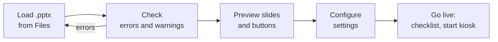
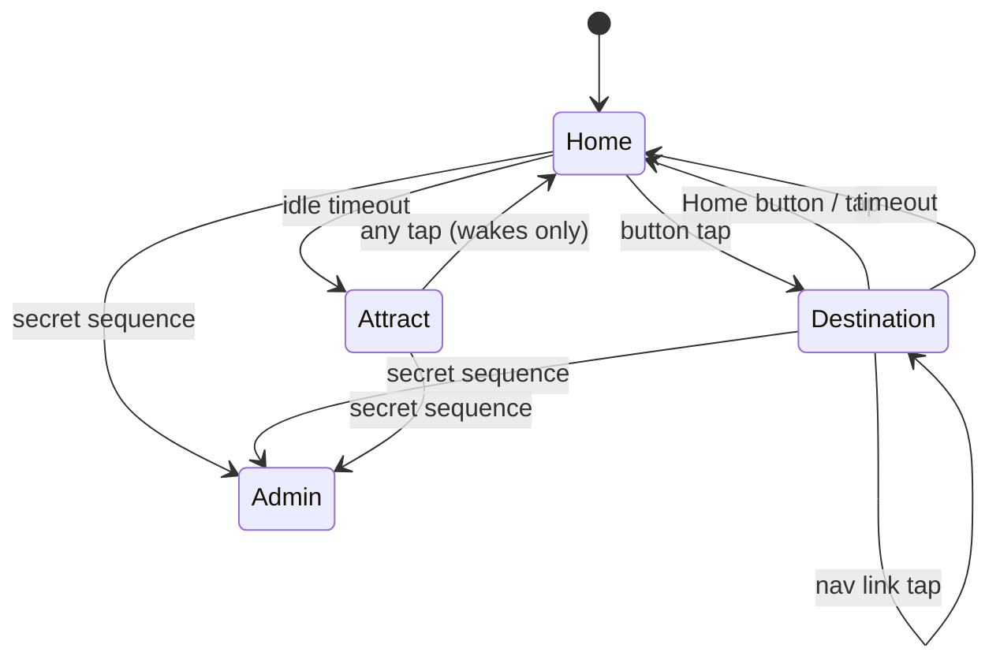

# iPad PowerPoint Kiosk App: Specification

Sep 24, 2026 (updated Sep 27, 2026) · @Graham Lehr

This is the requirements document. For how the implementation works and where things live in the code, see [ARCHITECTURE.md](ARCHITECTURE.md).

## Overview and goals

GGPad (the codebase is named stuPad) is an installable web app (PWA) that turns a structured PowerPoint file into a self-running, touch-driven iPad kiosk that logs every interaction and produces CSV and PDF reports offline.

Goals for v1:

- Load a .pptx from the iPad's Files app and render it in the browser, with no conversion step.
- Detect the buttons on the home slide automatically and map each to a destination slide.
- Run unattended: home slide, button press, destination slide, back to home (by tap or timeout).
- Log every interaction with a timestamp to on-device storage, surviving app restarts.
- Let the admin exit via a secret tap sequence and export a CSV log and a PDF summary.

Out of scope for v1: animation playback and audio, syncing logs across multiple iPads, and any server-side component after setup. Destination slides may link onward to further slides (see "PowerPoint template rules" and "Kiosk mode behaviour" below); a slide reachable only through such a chain still needs a way back to Home, which the kiosk provides as a fallback if the deck doesn't.

## Users and roles

Two roles, one device: the admin configures and exports; the end-user only ever sees kiosk mode.

| Role | Who | Can do | Cannot do |
| --- | --- | --- | --- |
| Admin-user | Event or stand staff | Load deck, configure settings, start/stop kiosk, export and clear logs | Leave the app while Guided Access is on |
| End-user | Public or delegates at the stand | Tap buttons, return to home slide | Reach settings, see other slides, leave the app |

There is no login. Admin access is protected by the secret tap sequence plus an optional 4 to 6 digit PIN.

## Platform and technical constraints

The app is a static PWA on iPadOS Safari, online once for install and setup, fully offline thereafter.

| Area | Decision | Why |
| --- | --- | --- |
| Target | iPadOS 17+, Safari, added to Home Screen, landscape only | Home Screen web apps get standalone display and persistent storage |
| Hosting | Static files, deployed to GitHub Pages under `/stuPad/` (any static host works); no backend | Nothing to run after setup |
| Offline | Service worker precaches the app shell, fonts and all libraries on first load | iPad has no internet during the event |
| File input | `<input type="file" accept=".pptx">` opening the Files app picker | A web app cannot read arbitrary file paths; the admin picks the file |
| PPTX parsing | JSZip + XML parsing of `ppt/slides/*.xml` and relationships | .pptx is a zip of XML; structure is fully readable |
| Slide rendering | Custom renderer to DOM/SVG at a fixed 16:9 canvas, scaled to screen | Direct rendering was chosen; see fidelity note below |
| Storage | IndexedDB for the deck, config and log; `navigator.storage.persist()` requested | localStorage is too small and synchronous for logs |
| PDF export | Generated on-device (e.g. jsPDF with charts drawn to canvas) | No server available |
| Lockdown | iOS Guided Access (or MDM Single App Mode) | A web app cannot stop the Home gesture on its own |

**Rendering fidelity.** Browser rendering of PowerPoint will never be pixel-identical. Fidelity is made reliable by constraining the deck (next section) rather than by building a full PowerPoint engine. After rendering, the setup screen shows every slide as a thumbnail so the admin can confirm it looks right before going live.

**Fallback option.** If a deck fails validation or renders badly, the renderer can rasterise each slide once during setup and store images, so kiosk mode only ever displays static images. Worth building in from the start as a safety net.

## PowerPoint template rules

Buttons are ordinary shapes on slide 1 with PowerPoint's own "Link to: Slide N" action, so the deck also works when played in PowerPoint.

**Structure**

1. Slide 1 is the home slide and must contain at least 2 button shapes.
2. Each button links to a later slide (Insert > Link > Place in This Document > Slide N). Stored in the XML as a `ppaction://hlinksldjump` click action.
3. Each destination slide may contain a shape linked back to slide 1, rendered as a "Home" button.
4. A destination slide may also contain shapes linking onward to a further slide — a "Next", "Back", or similarly named shape — so a deck isn't limited to a flat Home <-> Destination pair. These may be an explicit "Link to: Slide N", or PowerPoint's "Next Slide" / "Previous Slide" / "First Slide" / "Last Slide" actions (resolved relative to the shape's own slide, and clamped to the deck — a "Next Slide" link on the last slide simply has no target). A slide reached only through such a chain is still "linked" for validation purposes, but is still flagged with a warning if it has no way back to slide 1.
5. A shape with PowerPoint's "Last Slide Viewed" action (Insert > Action > Hyperlink to: Last Slide Viewed, stored as `ppaction://hlinkshowjump?jump=lastslideviewed`) is a "Back" link: it returns to whichever slide the visitor was on before this one, or to Home if they came straight from slide 1. Use it for a shared slide such as Terms and Conditions that several slides link to. A back link counts as a way back for the "no way back to slide 1" warning, but does not make any slide reachable.
6. A shape that links to its own slide is an authoring mistake, not a nav link: it is flagged as a warning and otherwise ignored, rather than crashing or creating a self-loop.
7. Slides not reachable from slide 1 (by a home-slide button, optionally followed by a chain of nav links) are ignored (flagged as a warning, not an error).
8. Two buttons may point to the same slide; they are still logged separately.

**Button naming.** The report uses the shape's name from the Selection Pane (e.g. `BTN_Sustainability`). If unnamed, the app uses the shape's text; if neither exists, "Button 1", "Button 2" in reading order. The admin can rename labels in setup.

**Polls and ratings.** A shape named `VOTE_<poll>_<choice>` (or `RATE_<poll>_<choice>` for a numeric rating, e.g. "Rate this stand 1 to 5") is a poll option, e.g. `VOTE_Topic_Sustainability` or `RATE_Stand_4`. It may sit on any slide, including slide 1 alongside buttons. The poll name (the segment right after the prefix) can't contain underscores; the choice name (everything after that) may. If it also has a slide link (an ordinary "Link to: Slide N", or a "Last Slide Viewed" back link), the kiosk records the vote and then follows the link as it would for any other linked shape, so "vote then see a thank-you slide" needs no new concept. On the home slide, a vote shape only acts as a button (and counts toward the two-button minimum) when its link goes to a later slide, exactly like an ordinary button; a home-slide vote shape with no link, one linking to slide 1 itself, or one using "Last Slide Viewed", is not a button, does not count toward the minimum, and is a plain vote with the Home cooldown described below (see "Kiosk mode behaviour"). The same poll name used with both `VOTE_` and `RATE_` prefixes is one poll, warned about and treated as a plain vote (no mean) rather than a rating. Warnings: a poll with only one option, the same choice used twice in one poll, and a `RATE_` choice that isn't a number (it's still counted, just left out of the mean).

**Video.** Insert a video "From File" (This Device) so PowerPoint embeds it in the .pptx; a video inserted as an online/linked file is not embedded, so the kiosk shows its poster frame only, with an `unsupported_element` warning at Check. Supported formats are mp4, m4v and mov; anything else also falls back to the poster with a warning. Playback options (play automatically vs. on click, and "Loop until stopped") are set in PowerPoint's own Animations/Playback settings for the video; the kiosk reads them at parse time. See "Video" under "Kiosk mode behaviour" for how it plays.

**Supported content**

| Element | Supported | Notes |
| --- | --- | --- |
| Solid, gradient and picture backgrounds | Yes | Including slide master and layout backgrounds |
| Images (PNG, JPEG, SVG) | Yes | Crops honoured |
| Text boxes and placeholders | Yes | Font, size, colour, bold/italic, alignment, bullets, autofit off |
| Basic shapes (rectangle, rounded rectangle, ellipse) | Yes | Fill, outline, corner radius |
| Groups | Yes | A group can be a button |
| Tables | Basic | Cell text and fills only |
| Charts, SmartArt | No | Paste as images first |
| Animations, transitions | No | Ignored; app uses its own fade |
| Video | Yes | Destination slides only; must be embedded (not a linked file) and mp4, m4v or mov; plays muted; see "Video" under Kiosk mode behaviour |
| Audio | No | Candidate for v2 |

**Fonts.** Use the web fonts bundled with the app (Inter, Lato, Montserrat, Open Sans, Roboto; Latin scripts) or iPad system fonts. Anything else falls back to a system font and is flagged at setup. Fonts embedded in the .pptx are not read, so embedding a font does not help.

**Slide size.** 16:9 (13.333 x 7.5 in). Other sizes are letterboxed.

The app ships with a downloadable template .pptx (`public/template.pptx`, edited by hand in PowerPoint) that follows all these rules. Its home slide is headed "GGPad Kiosk Template" and has buttons for Guide, Innovation, People, Contact and T&Cs. The Guide slides explain how to build a deck; the three topic slides are plain destinations with Home and T&Cs links; the T&Cs slide demonstrates a "Last Slide Viewed" Back link; and a final "Template rules" slide is deliberately unlinked, so loading the template shows one warning. It uses the Emota brand: Montserrat throughout, a blackberry home slide with the white Emota logo, light-lavender destination slides with the blackberry logo, and home buttons in teal, violet, grape and mint. Its theme colours and fonts are set to the Emota palette and Montserrat, so shapes and text added in PowerPoint start on-brand.

## Admin setup flow

Setup is one scrolling screen with five steps: load, check, preview, configure, go live.

The admin screens (Setup, admin panel, PIN pad, dialogs) use the Emota brand from `docs/brand/` (`emota-brand.css` and its cheat sheet): Montserrat, blackberry and night surfaces, and teal as the single accent. They are dark by default and switch to the brand's light variant when the iPad is set to light appearance. The Setup screen shows the Emota logo right-aligned beside the app name (the white file on dark, the blackberry file on light), with the app version (`v` plus the `package.json` version) as a subheading; the page title shows the same version. Slides are never restyled.

The Load step also offers "Download template deck", and the Go live step shows how many events are stored and how much of the iPad's storage quota is used.


```mermaid
flowchart LR
    A[Load .pptx<br/>from Files] --> B[Check<br/>errors and warnings]
    B -->|errors| A
    B --> C[Preview slides<br/>and buttons]
    C --> D[Configure<br/>settings]
    D --> E[Go live:<br/>checklist, start kiosk]
```

Validation errors (fewer than 2 buttons, broken links, unreadable file, no slides, file over 100 MB) block go-live. Warnings (missing fonts, unsupported elements, unlinked slides, no way back to slide 1, non-16:9 size, buttons under 44 pt, a shape linked to its own slide, a total embedded video size over 50 MB) are shown and must be accepted with a checkbox before going live. Invalid settings in Configure also block go-live. When the deck has any embedded video, the Check step also shows the total video size (videos count toward the 100 MB deck limit already enforced above).

The preview shows the home slide with each detected button outlined and labelled, plus a thumbnail of every slide (unlinked slides are marked). Tapping a button, nav link or back link in preview navigates as it will in kiosk mode, and "Back to home" returns to slide 1. An "image mode" checkbox rasterises every slide once to a PNG (the fallback above); a slide that cannot be rasterised keeps rendering live and the admin is told how many failed.

**Clear previous data.** The Load step has a "Clear previous data" button so the iPad can be handed to someone new without the last user's slides still showing. It removes the stored deck (with its images), settings, kiosk state and every logged event, then reloads into an empty Setup. It requires typing `CLEAR`, warns that logged taps cannot be recovered, and the wipe is itself logged as a single `log_cleared` record. The same action is on the admin panel.

**Configurable settings**

| Setting | Default | Range / options |
| --- | --- | --- |
| Button labels (for reports) | From shape name or text | Free text |
| Poll labels (for reports; shown only when the deck has poll options) | From the choice name, prettified | Free text, per poll choice |
| Return-to-home timeout | 20 s | 5 to 300 s, or off |
| Return method | Home button or timeout | Home button only / tap anywhere / timeout only / combination |
| Idle warning before timeout | Off | Show countdown in last 5 s |
| Button press feedback | Brief highlight | None / highlight / scale |
| Button glow | Off | A pulsing glow around every tappable area (home-slide buttons, Home, Next/Back links, and the fallback Home button), following each shape's outline (ellipse, rounded or square corners; pictures and groups get softly rounded corners). Colour: seven swatches or any colour from the picker. Intensity 1 to 10. Speed 0.5 to 4 s per pulse. The Setup preview shows it live |
| Transition | Fade 300 ms | None / fade, with a length of 150, 300, 500 or 800 ms when fade is selected |
| Debounce | 800 ms | 0 or more ms; repeat taps within this window are ignored |
| Secret exit sequence | Four corners clockwise from top-left, within 5 s | Corners clockwise from top-left / corners counter-clockwise from top-left / top-left ×3 then bottom-right ×2, with a window of 3, 5, 8 or 10 s. A corner is the outer 12% of the slide's width and height |
| Admin PIN after sequence | Off | 4 to 6 digits |
| Session name | Deck file name + date | Free text, required, printed on reports and used in export file names |
| Device name | Empty | Free text, optional, up to 40 characters, identifies which iPad this is (e.g. "Stand A"); printed in the PDF header and footer |
| Attract loop | Off | Idle time 15 to 600 s (30 s, 60 s, 2 min or 5 min in the picker, plus a stored out-of-list value). Mode: Cycle slides or Pulse on Home. In Cycle mode, seconds per slide 3 to 60 (4, 6, 8 or 12 s in the picker) and a checkbox per slide to include (Home is always included). See "Kiosk mode behaviour" below |

Loading a new deck resets every setting to its default, except the device name: it describes the iPad, not the deck, so it carries over unchanged. Settings and the parsed deck are saved to IndexedDB, so reopening the app resumes where it left off, including straight back into kiosk mode if it was running.

## Kiosk mode behaviour

Kiosk mode is a Home <-> Destination loop, but a destination slide can also navigate onward to a further destination slide (a "Next"/"Back" nav link — see "PowerPoint template rules"); every transition, including onward nav, is logged. A third mode, Attract, draws people in when nobody has touched the kiosk for a while (see below).


```mermaid
stateDiagram-v2
    [*] --> Home
    Home --> Destination: button tap
    Destination --> Destination: nav link tap
    Destination --> Home: Home button / tap
    Destination --> Home: timeout
    Home --> Attract: idle timeout
    Attract --> Home: any tap (wakes only)
    Home --> Admin: secret sequence
    Destination --> Admin: secret sequence
    Attract --> Admin: secret sequence
```

**Rules**

- Full-screen, no browser chrome, no visible UI other than the slide and its buttons.
- Only detected button areas respond on the home slide; taps elsewhere are logged as "miss" taps but do nothing. A poll/rating option is tested before buttons, so an unlinked one is never logged as a miss tap.
- On a destination slide, a tap is checked against any poll/rating option on that slide first, then the Home link, then any back links, then any nav links, then any video on the slide (see "Video" below); a nav link tap logs `slide_nav` and moves to the target slide without leaving destination mode. Checking links before video means a link drawn over (or under) a video always wins, so a large or full-bleed video can never swallow a tap meant for a link.
- A back link tap returns to the previous slide of the current visit (logged as `slide_nav`), or returns Home (logged as `return_home` with method `home_button`) if the visit started on this slide. The history belongs to one visit: it is cleared on every return to Home, including a timeout.
- The timeout timer starts when a destination slide appears and resets on any tap on that slide, including a nav link tap that moves to a further slide.
- If a destination slide has no shape linking back to slide 1 or back link (whether it's a direct destination or reached through a chain of nav links) and the Home button return method is enabled, the kiosk shows a discreet fallback Home button so no slide is a dead end.
- Repeat taps within the debounce window are ignored and not logged as presses.
- Pinch-zoom, text selection, long-press menus, pull-to-refresh and double-tap zoom are disabled.
- The screen is kept awake with the Screen Wake Lock API; if unavailable, the admin is told to set Auto-Lock to Never.
- The secret sequence works on any slide, including during the attract loop, and is checked before normal tap handling. A tap that continues or completes a sequence is consumed and never triggers a button. The first corner tap of a sequence is handled normally, so a button placed in a corner still works; the trade-off is that starting the sequence on a slide with a top-left button presses that button once (and, in attract mode, that same first tap also wakes the kiosk, since a corner tap that isn't yet continuing an attempt is handled as a normal tap, see below).
- Taps in the letterbox (outside the slide) do nothing and are not logged.
- If the app is closed or crashes, it relaunches straight into kiosk mode on the home slide.

**Polls and ratings.** A poll/rating option is hit-tested before every link on a destination slide, and before buttons on Home, so its vote is recorded even when the same shape is also a link or a button. It's one vote per poll per visit: once a poll has been voted in during the current visit, a repeat tap on any of its options logs nothing further (though a linked option's own link is still followed, and press feedback still shows). A new visit can vote in the same poll again. If the option is linked, the kiosk logs the vote and then follows the link exactly as it would for a plain link (a `button_press` on Home, or `slide_nav`/`return_home` on a destination slide), so "vote then see a thank-you slide" needs no extra concept. If it isn't linked, the kiosk shows press feedback and a brief "Thanks" overlay (1.5 s) instead. On Home, whether a vote shape takes the button path is decided the same way as for the two-button minimum above: only a link to a later slide makes it a button. A vote shape with no link, or one linking to slide 1 itself or using "Last Slide Viewed" (neither of which is a button), has no visit to dedupe against: the debounce still applies, and in addition each poll gets its own 3-second cooldown, so a rapid flurry of taps on the same option counts as one vote; press feedback and the Thanks overlay always show, but the vote itself, and re-arming the attract idle timer, only happen once the cooldown has passed, and a suppressed tap never logs a miss tap. A vote shape that is a button (its link goes to a later slide) starts a normal visit like any other button press, so it needs no separate cooldown. In attract mode, the wake tap never presses anything (see below) and so never votes either, even directly over a poll option.
- Home-slide votes with no link are counted in the report as interactions (see "Exit and reporting"), not as visits: they have no destination, dwell or return, so they don't affect average dwell, Return behaviour or Button share.

**Video.** A video always plays muted, whatever the deck's own volume setting; there is no volume control for it. On arrival at a destination slide, its first autoplay video (in element order) starts playing once the slide's transition has settled; a video set to play on click instead waits for a tap on it (a tap on a video that isn't already playing is checked last on that slide, after every link, so a link drawn over a video always wins; a tap on the video that's already playing falls through to tap-anywhere/timeout handling like any other tap). Only one video is ever playing at a time: a tap on a different video on the same slide switches to it, and leaving the slide (by any means) stops whichever video was playing. While the active video is playing, the return-to-home timeout and idle warning are paused (decision 3); they restart at the full configured timeout when the video finishes, or, for a looping video, after its first full play (a looping video never naturally ends, so the timeout otherwise never runs again). If iOS itself pauses the video (screen lock, switching app, Control Center), the timeout resumes immediately rather than waiting for a pause the visitor may never come back to undo; if playback then resumes (the app returns to the foreground), the timeout pauses again, unless the video had already finished its one timeout-pausing play. Returning to the app also resumes a video iOS paused this way on its own. A video that stalls or fails to play resumes the timeout immediately and falls back to its poster frame, so a broken file can never trap the kiosk on a slide. Home (slide 1) and the attract loop never play a video, even if one is placed there: both always show its poster frame. Each play is logged as `video_end` once the visitor leaves the slide or the video finishes (see "Interaction logging and data model").

**Attract loop.** When the attract setting is on, an idle timer starts once the kiosk is on Home and has nothing else to do: after kiosk start, after a miss tap, after returning to Home by any method, and after waking from a previous attract period. A button press (which leaves Home) or a tap that continues the secret sequence (which counts as activity but keeps the admin's attempt going) each cancel or restart it, so an admin working the exit sequence never accidentally triggers the loop underneath themselves. When the timer fires, the kiosk logs `attract_start` and enters Attract mode:

- **Cycle** crossfades through Home plus the chosen slides (any slide selected in Setup that still exists in the deck; slides removed since would just be skipped), one slide at a time, at a fixed 1000&nbsp;ms crossfade independent of the configured transition length, staying on each for the configured seconds-per-slide before advancing, and wrapping back to Home. Nothing on a non-Home slide is tappable in attract mode, so any button glow there stays hidden; Home's own glow (if on) plays normally whenever the cycle lands back on it. If nothing valid is left to cycle (the deck has no other slides, or none of the chosen ones still exist), it behaves like Pulse mode instead.
- **Pulse** stays on Home and shows a "Tap to start" overlay with a stronger version of the button glow (at least intensity 8, and visibly coloured even if the button glow setting is off).

**Decision: the tap that ends the loop only wakes the kiosk.** The first accepted tap in attract mode, wherever it lands (even directly over a button, and even when the cycle happens to be showing Home at that moment), stops the loop, shows Home with the configured transition, logs `attract_end` with `dwell_ms` (time spent in the attract period), and returns to Home mode. It never presses a button and never logs a `miss_tap`, so a heatmap or button-share report is never skewed by the loop drawing people in. That wake tap is itself the "accepted" tap for the debounce window, exactly like any other tap, so a quick second tap right after is debounced as usual and the next tap past the window is a normal Home tap.

Attract mode adds no work to the destination or Home tap path beyond a mode check and re-arming a single timer; `kiosk_stop` (Setup, or the admin panel's Setup button) ends whatever attract period is running without a separate `attract_end`, since the stop itself is the end. The admin panel and PIN pad overlay the stage and their own taps never reach the kiosk controller, but the idle timer keeps running underneath them (same as the destination timeout already does behind an open admin panel), so the loop can in principle start while the admin is in the panel; nothing currently suppresses that.

**Operator checklist (shown when starting kiosk)**

- [ ] Guided Access on (Settings > Accessibility > Guided Access)
- [ ] Auto-Lock set to Never
- [ ] iPad on charge
- [ ] Brightness and volume set

## Interaction logging and data model

Every event is written to IndexedDB the moment it happens, as one append-only record, so nothing is lost if the iPad restarts.

**Event types**

| Event | Logged when |
| --- | --- |
| `kiosk_start` / `kiosk_stop` | Admin starts or exits kiosk mode |
| `button_press` | A home-slide button is tapped |
| `slide_nav` | A destination-slide shape that links onward to a further slide ("Next"/"Back"), or a "Last Slide Viewed" back link that returns to a previous slide, is tapped |
| `return_home` | Destination slide closes; `method` = `home_button`, `tap` or `timeout` |
| `miss_tap` | Tap on the home slide outside any button |
| `app_resume` | App relaunches or returns to foreground in kiosk mode |
| `admin_unlock_fail` | Wrong PIN entered after the secret sequence |
| `log_cleared` | Clear log or Clear previous data wiped the log; the only record left after the wipe |
| `heartbeat` | Every 15 minutes while the kiosk is running, proving it's still alive; see "Uptime" below |
| `attract_start` | The idle timer fires on Home and the attract loop begins |
| `attract_end` | A tap wakes the kiosk from the attract loop; `dwell_ms` is the time spent in that attract period. Not logged when the loop is ended by `kiosk_stop`, `kiosk_start` or `app_resume` instead of a tap |
| `vote` | A poll/rating option (`VOTE_`/`RATE_` shape) is tapped and its poll hasn't already been voted in during this visit; `poll` and `choice` name the option. Has a `visit_id` for a destination-slide vote or a linked home vote (the same visit a `button_press`/`slide_nav`/`return_home` would use); no `visit_id` for an unlinked home vote |
| `video_end` | A video finishes (or, for a looping video, is left while still playing), or the visitor leaves the slide it was playing on with any watched time; not logged for a video that was never actually played. `watched_ms` and `completed` record how much of it was seen |

**Record fields**

| Field | Type | Example |
| --- | --- | --- |
| `id` | integer, auto-increment | 1042 |
| `ts` | ISO 8601 with local offset | 2026-10-14T10:32:07.412+01:00 |
| `session_id` | UUID, one per kiosk run | 7f3c… |
| `visit_id` | UUID, one per button press to return | a91e… |
| `event` | enum, as above | button\_press |
| `button_id` | shape id from the PPTX; on `slide_nav`, the id of the button that started the visit | 4 |
| `button_label` | text; on `slide_nav`, the label of the button that started the visit | Sustainability |
| `slide_from` / `slide_to` | integer; on `slide_nav`, the slide being left and the slide being entered; on `return_home`, the slide being left and 1; on `miss_tap`, `slide_from` is 1 | 1 / 3 |
| `method` | enum, return events only | timeout |
| `dwell_ms` | integer; on `return_home`, time for the whole visit; on `slide_nav`, time spent on just the slide being left; on `attract_end`, time spent in the attract period | 18420 |
| `x`, `y` | tap position as % of slide, rounded to 0.1, miss taps only | 12.5, 88.0 |
| `poll`, `choice` | poll and choice names from the shape's `VOTE_`/`RATE_` name, `vote` events only | Topic, Net_Zero |
| `watched_ms` | integer; actual playing time, `video_end` only | 18420 |
| `completed` | boolean; whether the video reached its end at least once (a looping video's first full play counts), `video_end` only | true |

`dwell_ms` on each return gives time spent per destination, which is the most useful engagement measure after raw press counts. `slide_nav` events let a report break that down further into time spent per slide within a multi-slide visit, and count arrivals at each slide.

Logs persist until the admin explicitly clears them after export, either with Clear log or with Clear previous data (which also removes the deck and settings). Both delete every stored event, not just the current session's, require typing `CLEAR`, and are themselves logged as `log_cleared`.

## Exit and reporting (CSV and PDF)

After the secret sequence (and PIN, if set) the admin lands on an admin panel with Resume, Export, Clear log, Clear previous data and Setup. Three wrong PIN entries, or 30 s without input, return to the kiosk without granting access; each wrong entry is logged as `admin_unlock_fail`. Clearing the log, or clearing all previous data, requires typing `CLEAR`.

The panel shows the current session's presses, visits, average dwell and miss taps, plus the total number of stored events and the storage used. Resume returns to the same session (no new `kiosk_start`). Setup ends the session (`kiosk_stop`) and returns to the Setup screen with the deck and settings intact.

**Getting files off the iPad.** Exports use the iOS share sheet (Web Share API with files), giving Save to Files, AirDrop and Mail. Plain browser downloads are unreliable in Home Screen web apps, so they are only a fallback.

**Export scope.** Current session, a date range, or all data. The panel shows how many events are in the chosen scope before exporting.

**CSV**

One row per event, all fields from the data model, with a header row. RFC 4180 quoting, CRLF line endings, and UTF-8 with a byte-order mark so Excel reads non-ASCII labels correctly. `poll`, `choice`, `watched_ms` and `completed` are appended at the end, after `x`/`y`, so a spreadsheet that reads earlier columns by position is unaffected. File name: `<session-name>_<yyyy-mm-dd-hhmm>.csv`.

```csv
id,ts,session_id,visit_id,event,button_id,button_label,slide_from,slide_to,method,dwell_ms,x,y,poll,choice,watched_ms,completed
1042,2026-10-14T10:32:07.412+01:00,7f3c,a91e,button_press,4,Sustainability,1,3,,,,,,,,
1043,2026-10-14T10:32:25.832+01:00,7f3c,a91e,return_home,,,3,1,timeout,18420,,,,,,
1044,2026-10-14T10:32:40.000+01:00,7f3c,,vote,,,3,,,,,,Topic,Net_Zero,,
1045,2026-10-14T10:32:55.000+01:00,7f3c,a91e,video_end,4,Sustainability,3,,,,,,,,18420,true
```

**PDF report (A4 landscape)**

| Page | Content |
| --- | --- |
| 1. Summary | An "Interactions" tile (total visits plus home-slide votes with no link) shown first, only when the log has any `vote` events. Session name (with the device name alongside it, when set), date/time range, total presses, total visits, average dwell, miss taps, number of buttons, an "Uptime" tile (e.g. "97%", or "n/a" with no monitored span), onward nav taps (when any), an "Attract pull-in" tile (e.g. "12 / 40 (30%)", attract\_end count over attract\_start count, only shown when the loop has run at least once), thumbnail of home slide; a compact "Slide views" table (arrivals per slide) when the deck has any onward nav taps |
| 2. Button share | Donut of presses by button with counts and %; horizontal bar of average dwell per button |
| 3. Home slide taps (only when there are miss taps) | Heatmap of where visitors tapped and missed on the home slide (48 x 27 grid of cells, white-to-blackberry ramp), with each button's bounds drawn as an outline and label over it, and the home thumbnail underneath when one is available. Caption: miss taps as a share of all home-slide taps (button presses + miss taps). Miss taps during the attract loop are never logged, so they never appear here |
| 4. Activity over time | Stacked bar chart of presses per interval, one colour per button, with a light shaded band behind any bucket that overlapped an attract period (opacity scaled by how much of the bucket's own span was in attract mode) and a legend entry "Attract loop" when any bucket has one, plus a thin up/down strip underneath it on the same time axis (green for a monitored running span, muted red for a downtime gap, neutral grey for an unmonitored span with no heartbeat data, light grey outside any span), legend "Running / Down / Stopped" plus "No heartbeat data" when the scope has an unmonitored span. The interval is the finest of 5, 15, 30, 60, 120, 240 min or 1 day that keeps the chart to 48 bars or fewer |
| 5. Return behaviour | Split of returns by Home button, tap and timeout; share of visits ending by timeout per button |
| 6. Slides and paths (when there are onward nav taps, any video plays, or both) | With onward nav taps: left, horizontal bars of median time spent per slide, plus a second bar excluding timeout-ended visits; right, a table of the most common routes through the deck ("3 → 4 → 5"), each with a count and %, top 8 plus an "Other" row. When the deck has any video plays, a "Video" table (Slide, Plays, Median watched, Watched to end) is added below the paths table; if there are no onward nav taps at all, the whole page is just this Video table, titled "Video" instead of "Slides and paths" |
| 7. Poll results (one page per poll with at least one vote) | Title "Poll results: \<poll label\>"; a horizontal bar chart of the poll's choices with count and %; for a `RATE_` poll, also "Mean score 4.2 (n = 37)" (numeric choices only; a non-numeric `RATE_` choice is counted in the bars but excluded from the mean). Counts every vote, home and destination alike |
| 8. Hour-by-day (multi-day only) | Heatmap of presses by hour and day |

If the scope has no events, the report is a single Summary page reading "No interactions recorded." Button colours are consistent across every chart. Charts are drawn on-device to canvas and embedded as images in the PDF. Every page has a footer: `GGPad · <device name, when set> · <session name> · page n/N · generated <time>`.

**Uptime.** A running span opens at `kiosk_start`; if no span is already open, any other event opens one too, since events are only ever logged while the kiosk is running, so an event with no span open means the scope simply cut off the `kiosk_start` that would have opened it (a date-range export, for example). The one exception is `kiosk_stop`: with no span open it closes nothing and starts nothing. A span closes at the matching `kiosk_stop`; if the log ends, or another `kiosk_start` arrives, while a span is still open, that span closes at its own last event instead. Time outside any span (kiosk stopped, admin in Setup) is neither up nor down.

Uptime is measured only for a span that contains at least one `heartbeat`, i.e. a span logged by 1.5.0 or later. A span with no heartbeat at all (an older log, or a new-build span too short for one 15-minute tick) is "unmonitored": its whole duration is reported separately and never counted as up or down, since without a heartbeat there is nothing to measure a silence against. Within a monitored span, every consecutive pair of events (heartbeats, taps, `app_resume`, anything) is walked in order: a gap longer than 20 minutes between them is downtime, everything else is uptime, so uptime plus downtime always equals the total time spent in monitored spans. An `app_resume` after a long silence inside an already-open span (rather than opening a new one) is exactly how a kill, relaunch or extended backgrounding shows up, and the gap right before it is the downtime that's shown. The uptime percentage is uptime over uptime-plus-downtime across monitored spans only, "n/a" when there are none. A scoped report (a date range, a single session) computes uptime over just the events in that scope.

A `heartbeat` extends the report's date/time range (`firstTs`/`lastTs`, and so the Activity chart's time axis and bucket width) exactly as `kiosk_start`/`kiosk_stop`/every other event already did, but it is never counted as a calendar day on its own: a session that merely stays running past midnight with no other activity does not become a multi-day report, and a heartbeat never changes a press, visit or activity count.

**Time per slide and common paths.** For a deck with onward navigation (nav links or "Last Slide Viewed" back links), the report reconstructs each visit's route: the button's target slide, then each `slide_nav.slide_to`, in order (a back link can send a visitor to a slide already in the path, so the same slide number can appear twice). Time on a slide left by navigation is that `slide_nav`'s `dwell_ms`; time on the last slide of a visit is the `return_home` timestamp minus the visitor's last arrival there (not `return_home.dwell_ms`, which is the whole visit). A visit that never reaches `return_home` (the app was killed, or the export scope starts or ends mid-visit) is left out of the slide-time numbers, since its last, unfinished stay was never timed, but it is still counted in the path table, suffixed "(ended)": e.g. "3 → 4 (ended)" is a separate row from "3 → 4". A `slide_nav` or `return_home` whose `visit_id` has no matching `button_press` in the scope is ignored entirely (the scope cut the visit in half). The last slide of a visit that ends by `timeout` can overstate time spent by up to the configured timeout, so the chart's primary bar and its median (not the mean) are the headline number, and the second bar recomputes the median with every timeout-ended visit's last-slide stay excluded (its earlier slides, timed by `slide_nav.dwell_ms`, are unaffected and stay in both bars). The slide-time chart shows at most 16 slides, keeping the ones with the most timed stays (then listing them in ascending slide order) and noting how many more slides aren't shown, so labels stay legible on a deck with many destination slides.

## Non-functional requirements

| Requirement | Target |
| --- | --- |
| Tap to slide change | Under 150 ms |
| Deck parse and render at setup | Under 10 s for a 20-slide, 50 MB deck |
| Maximum deck size | 100 MB |
| Unattended run time | 12 hours continuous, no memory growth (verified by a manual soak test on a device; there is no automated soak test) |
| Log capacity | 100,000 events without slowdown |
| Data durability | No event lost on app kill, crash or power loss after the write completes |
| Privacy | No personal data collected; nothing leaves the device except admin-initiated exports |
| Accessibility | Buttons at least 44 x 44 pt; slide content is the client's responsibility |
| Test devices | Current iPad (10th gen or later) and iPad Air on the two latest iPadOS versions |

## Open questions and assumptions

**Assumptions made in this draft**

- One iPad per deployment; no merging of logs across devices.
- Static slides only, plus video on destination slides (see "Video" under Kiosk mode behaviour); no audio or animation in v1.
- Landscape 16:9 decks.
- Internet is available once for install and setup, never during the event.

**Open questions**

- [ ] What is the typical use: exhibition stand, poll or vote, wayfinding, content menu? This shapes the report's headline metric.
- [ ] Is there ever more than one iPad at the same stand, and should reports combine them?
- [ ] Branding on the PDF report: agency, client, or neutral? (Today the admin UI and template are Emota-branded; the PDF is neutral apart from the GGPad footer and a blackberry heatmap.)
- [ ] Should one iPad hold several decks and switch between them, or one deck at a time?
- [ ] Pharma use: any ABPI or data-retention constraints on logging, even anonymous taps?
